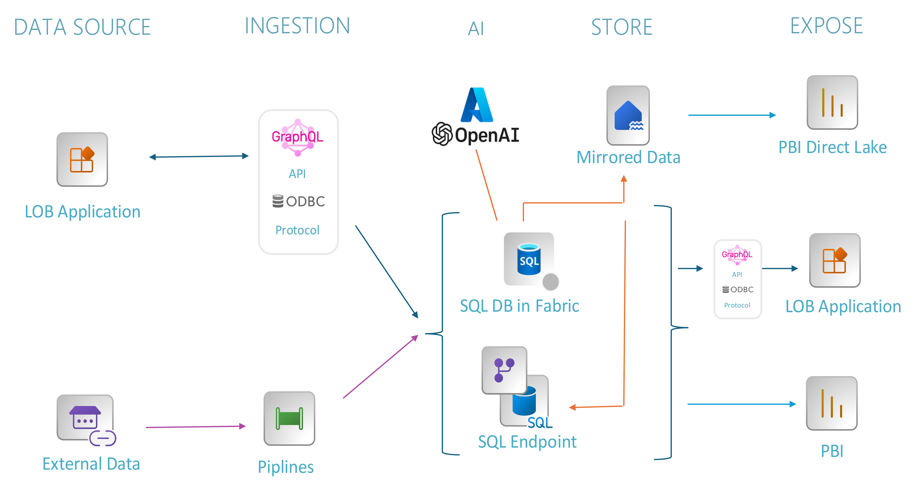

# Workshop: SQL database in Microsoft Fabric

## Introduction and Getting Started

#### A Microsoft Workshop from the SQL Server Team

### Introduction and Overview

In this module, you'll cover the basics of getting started with SQL database in Fabric: creating workspaces, creating the database, and seeding the database with initial data that you will use in later modules.

Our final system architecture will look similar to the following:



In each module, you'll get more references, which you should follow up on to learn more. Also, watch for links within the text - click on each one to explore that topic.

*Make sure you check out the [Pre-Requisites](https://github.com/akatesmith/SQL-database-in-Fabric-Workshop/blob/main/sqldev/00%20-%20Pre-Requisites/00%20-%20Pre-Requisites.md) page before you start. You'll need all of the items loaded there before you can proceed with the workshop.*

You'll cover these topics in this module:

1. [Creating a Fabric Workspace](https://github.com/akatesmith/SQL-database-in-Fabric-Workshop/blob/main/sqldev/01%20-%20Introduction%20and%20Getting%20Started/01%20-%20Introduction%20and%20Getting%20Started.md#11-creating-a-fabric-workspace)
2. [Creating a SQL Database in Fabric](https://github.com/akatesmith/SQL-database-in-Fabric-Workshop/blob/main/sqldev/01%20-%20Introduction%20and%20Getting%20Started/01%20-%20Introduction%20and%20Getting%20Started.md#12-creating-a-sql-database)
3. [Setting up the SQL Database for the Remainder of the Workshop](https://github.com/akatesmith/SQL-database-in-Fabric-Workshop/blob/main/sqldev/01%20-%20Introduction%20and%20Getting%20Started/01%20-%20Introduction%20and%20Getting%20Started.md#13-setting-up-the-database-with-initial-objects)

### 1.1 Creating a Fabric Workspace

Fabric is organized by workspaces - each workspace is an integrated playground across all Fabric services. In order to get started with this workshop, you start by creating a workspace which will host all of the Fabric artifacts you create along the way. The workspace contains all the items needed for data warehousing, including Data Factory pipelines, the data warehouse, Power BI semantic models, the SQL database in Fabric, and reports.

#### Activity: Create a Workspace

1. Sign in to Power BI.
2. Select **Workspaces > New workspace**.
3. Fill out the **Create a workspace** form as follows:
   - **Name**: Enter `<your username> Sessions Finder`  (Replace <your username> with your name or user name.)
   - **Description**: Optionally, enter a description for the workspace.
   - Expand the **Advanced** section.
   - Choose **Fabric capacity** or **Trial** in the **License mode** section.
   - Choose a premium capacity that you have access to.
   - Select **Apply**. The workspace is created and opened.

### 1.2 Creating a SQL Database

You will create a SQL database inside our new Fabric workspace.

#### Activity: Create the Database

1. Ensure you are in the workspace you just created by clicking the **Workspaces** icon in the navigation bar, and then selecting the workspace you just created.
2. Create a SQL database by clicking **+ New Item** in the top icon bar.
3. In the **New Item | All Items** panel, scroll to the **Store Data** area and click **SQL database**.
4. Fill in the **Name** field with the text `Sessions_database` and click the **Create** button.

   Database creation should take less than a minute.

### 1.3 Setting Up the Database with Initial Objects

You will create some initial objects and tables to set up for the future steps.

#### Activity: Seed the Database with Initial Objects

1. Open the database you just created.
2. Select the **New Query** icon at the top to open the Fabric query editor.
3. Copy and paste the text from [`01 - Id.sql`](https://github.com/akatesmith/SQL-database-in-Fabric-Workshop/blob/main/sqldev/01%20-%20Introduction%20and%20Getting%20Started/01%20-%20Id.sql) into the editor and run it.
```sql

-- Create a global ID
CREATE SEQUENCE [global_id]
    AS INT
    START WITH 1
    INCREMENT BY 1;
GO
```
4. Open a second query window. Copy and paste the text from [`02 - Tables.sql`](https://github.com/akatesmith/SQL-database-in-Fabric-Workshop/blob/main/sqldev/01%20-%20Introduction%20and%20Getting%20Started/02-%20Tables.sql) into the editor, and run that.
```sql
-- Creates a table to log the text that has been searched.
CREATE TABLE [searched_text]
(
    [id] INT IDENTITY (1, 1) NOT NULL,
    [searched_text] NVARCHAR (MAX) NOT NULL,
    [search_datetime] DATETIME2 (7) DEFAULT (sysdatetime()) NOT NULL,
    [ms_rest_call] INT NULL,
    [ms_vector_search] INT NULL,
    [found_sessions] INT NULL,

    PRIMARY KEY CLUSTERED ([id] ASC)
);
GO

-- The sessions table will hold the titles and abstract information about each session.
-- We also include an embeddings column which will be used later for AI-integration.
CREATE TABLE [sessions]
(
    [id] INT DEFAULT (NEXT VALUE FOR [global_id]) NOT NULL,
    [title] NVARCHAR (200) NOT NULL,
    [abstract] NVARCHAR (MAX) NOT NULL,
    [external_id] VARCHAR (100) COLLATE Latin1_General_100_BIN2 NOT NULL,
    [last_fetched] DATETIME2 (7) NULL,
    [start_time] DATETIME2 (0) NOT NULL,
    [end_time] DATETIME2 (0) NOT NULL,
    [tags] NVARCHAR (MAX) NULL,
    [recording_url] VARCHAR (1000) NULL,
    [require_embeddings_update] BIT DEFAULT ((0)) NOT NULL,
    [embeddings] VARBINARY(8000) NULL,

    PRIMARY KEY CLUSTERED ([id] ASC),
    CHECK (isjson([tags])=(1)),
    UNIQUE NONCLUSTERED ([title] ASC)
);
GO

-- The speakers table will hold the name information about each speaker.
-- We also include an embeddings column which will be used later for AI-integration.
CREATE TABLE [speakers]
(
    [id] INT DEFAULT (NEXT VALUE FOR [global_id]) NOT NULL,
    [external_id] VARCHAR (100) COLLATE Latin1_General_100_BIN2 NULL,
    [full_name] NVARCHAR (100) NOT NULL,
    [require_embeddings_update] BIT DEFAULT ((0)) NOT NULL,
    [embeddings] VARBINARY(8000) NULL,

    PRIMARY KEY CLUSTERED ([id] ASC),
    UNIQUE NONCLUSTERED ([full_name] ASC)    
);
GO

-- sessions_speakers links speakers to individual sessions.
CREATE TABLE [sessions_speakers] (
    [session_id] INT NOT NULL,
    [speaker_id] INT NOT NULL,

    PRIMARY KEY CLUSTERED ([session_id] ASC, [speaker_id] ASC),
    CONSTRAINT fk__sessions_speakers__sessions FOREIGN KEY ([session_id]) REFERENCES [sessions] ([id]),
    CONSTRAINT fk__sessions_speakers__speakers FOREIGN KEY ([speaker_id]) REFERENCES [speakers] ([id])
);
GO

CREATE NONCLUSTERED INDEX [ix2]
    ON [sessions_speakers]([speaker_id] ASC);
GO

```
5. Open a third query window. Copy and paste the text from [`03 - Insert first sessions.sql`](https://github.com/akatesmith/SQL-database-in-Fabric-Workshop/blob/main/sqldev/01%20-%20Introduction%20and%20Getting%20Started/03%20-%20Insert%20first%20sessions.sql) into the editor, and run this. (*Note: This data was generated by AI*)

   You have now created some initial objects and put a few items into the tables. You will work with these objects and tables throughout the rest of this workshop.

---

Congratulations! You have successfully created your database in a new Fabric workspace. The database is appropriately set up for you to explore how this database integrates with other Fabric artifacts.  You are ready to move on to the next section: [Dataflows, Notebooks, and Reports](https://github.com/akatesmith/SQL-database-in-Fabric-Workshop/blob/main/sqldev/02%20-%20Dataflows%2C%20Notebooks%2C%20and%20Reports/02%20-%20Dataflows%2C%20Notebooks%2C%20and%20Reports.md)

---
